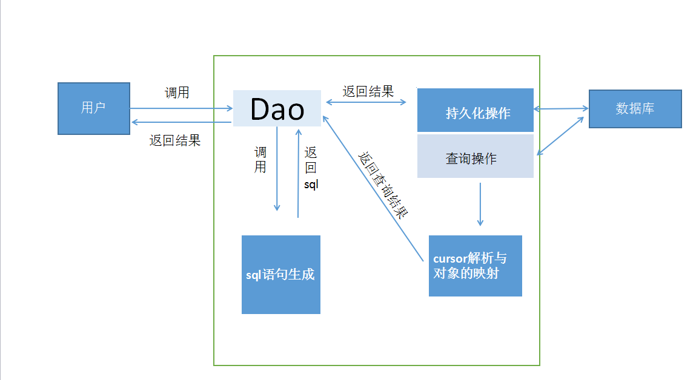


##MiniOrm-for-Android是什么?
MiniOrm-for-android  是一款简单，只能，灵活的android   ORM框架，完全基于对象进行操作。主要帮助android程序员的快速开发。通过反射将查询的数据智能的转换成 Entity 。省去开发人员手动解析的时间。

##[新版效率更高](https://github.com/MengLeiGitHub/MiniOrm-2)

##功能特点：

* 小巧，类库大小27k
 
* 使用简单，支持实体类注解方式，除了实体类之外只需创建一个DAO就可以进行操作。

* 支持原声的sql语句操作

* 耦合性低

##结构模型：

* 类关系图（核心不含有数据库操作部分）：
    纯java结构设计，通过接口的设计，将上层业务和实际操作数据库的部分进行分离，开发者可以在此基础上自行实现mysql。。。等数据的支持。下面是java部分核心设计

##接入方法

####在你项目的 build.gradle 文件里添加如下配置 
<pre><code>
 
  
dependencies {
  
    compile 'com.ml.miniorm:miniorm:1.1.9'
}

 
 </code></pre>

##使用方法：

####  框架初始化：

 <pre><code>
 
//框架初始化，也可放在activity中
 public class MyApplication extends Application {
    @Override
    public void onCreate() {
        super.onCreate();
        //test.db数据库名称
        //1数据库版本号    
        MiniOrm.init(this,1,"test.db");
        //如果表中新增字段，需要升级数据库，需要指定那个该表对应的Dao
        MiniOrm.addUpdateTable(TeacherDao.class);
        //注：如果数据库版本需要升降级别，并且表未做任何改变，最好不要指定该Dao类，否则会做一些不必要的工作，浪费手机性能
        
        
    }
}
 
 
 </code></pre>
    

####  实体创建：

 <pre><code>
 
 
    import com.miniorm.android.ColumnType;
    import com.miniorm.annotation.Table;
    import com.miniorm.annotation.TableColumn;
    import com.miniorm.annotation.TableID;
    import com.miniorm.enumtype.Parmary;

    @Table(name="student")
    public class Student {
       
       @TableID(name="sid",isPrimaryKey=true,defaultVal=0,type=   Parmary.AutoIncrement,columnType= ColumnType.INTEGER)
       private int id ;
       
       @TableColumn(name="stuname",columnType=ColumnType.TEXT)
       private String stuName;
       
       
       @TableColumn(name="age",columnType=ColumnType.INTEGER)
       private int age;
     
       public int getId() {
          return id;
       }
    
    
       public void setId(int id) {
          this.id = id;
       }
    
    
       public String getStuName() {
          return stuName;
       }
    
    
       public void setStuName(String stuName) {
          this.stuName = stuName;
       }
    
    
       public int getAge() {
          return age;
       }
    
    
       public void setAge(int age) {
          this.age = age;
       }
    
    
       @Override
       public String toString() {
          return "age="+age+"  stuname="+stuName+" id="+id;
       }
    }
     
     
 </code></pre>

####注解说明：
* @Table(name="student")设置表名 为 “student”
* @TableID(name="sid",isPrimaryKey=true,defaultVal=0,type= Parmary.AutoIncrement,columnType= ColumnType.INTEGER)
 依次顺序表示 ： 字段名= sid ，字段为表 主键 ，默认数字为   0   ,主键为自动增长，字段类型是
    Integer类型
 注意：如果主键为自增长的话，那么columnType= ColumnType.INTEGER必须设置为INTEGER类型
       如果主键是自设置的话，无限制，但只能为 整型（INTEGER）或字符型

####含有外键对象实体的创建：

 <pre><code>
 
    package com.test.test;
    
    import com.miniorm.android.ColumnType;
    import com.miniorm.annotation.Table;
    import com.miniorm.annotation.TableColumn;
    import com.miniorm.annotation.TableID;
    import com.miniorm.enumtype.Parmary;
    
    @Table(name="userTable")
    public class Teacher {
    
        @TableColumn(name="username",columnType= ColumnType.TEXT)
    	private  String userName;
    
    	@TableColumn(name="pwd",columnType=ColumnType.TEXT)
    	private  String pwd;
    	
    
    	@TableID(isPrimaryKey=true,name="userid",defaultVal=0,type= Parmary.CUSTOM,columnType=ColumnType.INTEGER)
    	private int id;
    	
    	@TableColumn(name="sid",isForeignkey=true,columnType=ColumnType.INTEGER,HierarchicalQueries = true)
    	private Student student;
    
    	@TableColumn(name="sex",columnType=ColumnType.VARCHAR)
    	private  String sex;
    	@TableColumn(name="shengao",columnType=ColumnType.INTEGER)
    	private  int shengao;
    
    	@TableColumn(name="isGril",columnType= ColumnType.BOOLEAN,IgnoreBooleanParam = false)
    	private  boolean isGril;
    
    
    
    	public String getUserName() {
    		return userName;
    	}
    	public void setUserName(String userName) {
    		this.userName = userName;
    	}
    	public String getPwd() {
    		return pwd;
    	}
    	public void setPwd(String pwd) {
    		this.pwd = pwd;
    	}
    	public int getId() {
    		return id;
    	}
    	public void setId(int id) {
    		this.id = id;
    	}
    	public Student getStudent() {
    		return student;
    	}
    	public void setStudent(Student student) {
    		this.student = student;
    	}
    
    	public String getSex() {
    		return sex;
    	}
    
    	public void setSex(String sex) {
    		this.sex = sex;
    	}
    
    	public int getShengao() {
    		return shengao;
    	}
    
    	public void setShengao(int shengao) {
    		this.shengao = shengao;
    	}
    
    	public boolean isGril() {
    		return isGril;
    	}
    
    	public void setIsGril(boolean isGril) {
    		this.isGril = isGril;
    	}
    }

 </code></pre>

   ####和普通实体创建唯一不同的地方就是含有外键的对象
*  TableColumn(isForeignkey=true)设置注解的属性为外键
*  HierarchicalQueries = true 表示为外键和主键级联查询，默认此属性为 true 
*  IgnoreBooleanParam=false   如果在实体类中含有布尔变量，并且该变量保存在了数据库，那么该值就是在按照 
*  teacherDao.queryListByEntity(teacher)或者  teacherDao.queryByEntity(teacher);  查询的时候，
*      忽视属性  isGril该值的变量

###创建工具类

<code><pre>
public class TeacherDao  extends androidBaseDao< Teacher> {

   @Override
   public Teacher getQueryEntity() {
      // TODO Auto-generated method stub
      Teacher teacher=new Teacher();
      return teacher;
   }
}

import com.miniorm.android.androidBaseDao;

public class StuDao extends androidBaseDao< Student> {

   @Override
   public Student getQueryEntity() {
      // TODO Auto-generated method stub
      return new Student();
   }

}

</code></pre>

    

#####创建表
<code><pre>

StuDao stuDao=new StuDao();
stuDao.createTable()；
TeacherDao teacherDao=new TeacherDao();
int  i=teacherDao.createTable();

ResultType.SUCCESS==i  表示创建成功
ResultType.FAIL==i  表示创建失败

</code></pre>

#####新增：
<code><pre>
Student student=new Student();
 student.setAge(2);
 student.setStuName("王小明");
Int  id=stuDao.save(student);
if(id!=ResultType.FAIL){
    Id==新增 对象的id
}

</code></pre>

####批量新增：
<code><pre>
ArrayList<Student>  lis2t=new ArrayList<>();
for (int i2=0;i2<10000;i2++){
   Student student1=new Student();
   student1.setStuName("student"+i2);
   student1.setAge(i2);
   lis2t.add(student1);
}
 
stuDao.save(lis2t);

stuDao.saveOrUpdate(lis2t);
</code></pre>

*  stuDao.save(lis2t); 该方法执行的时候，两种情况
*     1.该表主键设置为自增长（type = Parmary.AutoIncrement）  该方法执行会在表中新增一条数据
*     2.设置为自定义主键  （type= Parmary.CUSTOM） 的话，指定的主键的值如果在表中含有相同的话，则不会执行成功
*  stuDao.saveOrUpdate(lis2t);  同样的和save的方法对比
*     1.如果相同的数据，就算 不指定主键，如果其他的属性值和表中某条数据都相同，该方法也不会在数据库新增。相反 如果没有和该数据都相同的，就会新增
*     2.如果指定了主键 就会更新原来的数据

####删除：
<code><pre>
######Id删除
Student student1=new Student();
student.setId(2);
stuDao.delete(student);
 

######根据其他属性删除
Student student=new Student();
student.setStuName("kkkk");
    student.setAge(2);
stuDao.delete(student);

#####删除全部
stuDao.deleteAll();
</code></pre>

####更新
<code><pre>

 注意，需指定ID）
student.setId(2);
student.setStuName("kkkk");
stuDao.update(student);

</code></pre>

####查询
<code><pre>

#####按照实体查询
   ######（注意）
   *  指定id，查询出唯一一个 
   *  设置其他参数，非id ，如有数据值返回第一个
    ）

Student student1=    stuDao.QueryByEntity(student);

#####查询全部
List<Student> list=stuDao.queryAll();

#####按照ID查询
stuDao.queryById(1)||stuDao.queryById(“1”)
</code></pre>
####精确条件查询
#####可以写sql语句 然后直接调用方法
<code><pre>
teacherDao.executeQuery("select * from usertable",teacherDao.getQueryEntity(),teacherDao.getReflexEntity() );
</code></pre>
#####调用QueryBuilder          
<code><pre>
    //查询 全部 性别为 女  
    List<Teacher> listaaa=teacherDao.getQueryBuilder().callQuery().queryAll().where(Where.handle().eq("sex","女")).executeQueryList();
    
    List<Teacher> listaaa=teacherDao.getQueryBuilder().callQuery().queryAll().where(Where.handle().and("sex","=","女")).executeQueryList();

    
    //模糊查询
    List<CustomerBean> list = customerBeanDao.getQueryBuilder().callQuery().queryAll().where(Where.handle().and("userName", "    like  ", "%"+tiaojian+"%").or().and("company", "  like  ", "%"+tiaojian+"%").or().and("nickname", "  like  ", "%"+tiaojian+"%")).executeQueryList();
    //对应的 sql  select  * from   CustomerBean  where   userName    like  '%你曾%'   or   company  like  '%你曾%'   or   nickname  like  '%你曾%' ;
        

    //根据主键分页
    int lastid = teacherDao.queryLastInsertId();
    String table = teacherDao.getReflexEntity().getTableEntity().getTableName();
    String column = teacherDao.getReflexEntity().getTableIdEntity().getColumnName();
    List list1 = teacherDao.getQueryBuilder().callQuery().queryAll().where(Where.handle().and(column, "<=", lastid).and(column, ">", lastid - 10).desc()).executeQueryList();
 

</code></pre>

##代码混淆
<code><pre>
-keep class com.miniorm.**
-keepclassmembers class com.miniorm.** { *; }
-keep enum com.miniorm.**
-keepclassmembers enum com.miniorm.** { *; }
-keep interface com.miniorm.**
-keepclassmembers interface com.miniorm.** { *; }

</code></pre>

##有问题反馈
在使用中有任何问题，欢迎反馈给我，可以用以下联系方式跟我交流

* 邮件:menglei0207@sina.cn
* QQ群: 215233258
* 本人其他开源github:https://github.com/MengLeiGitHub/)